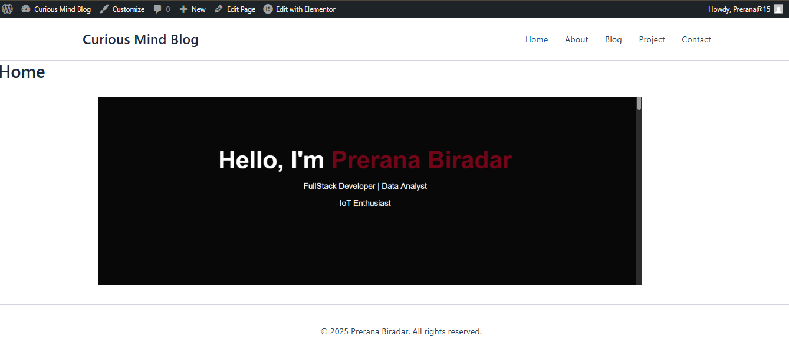
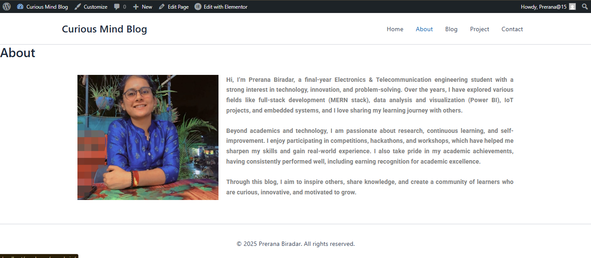
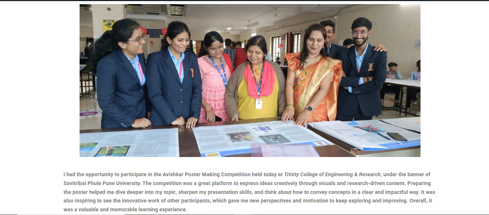
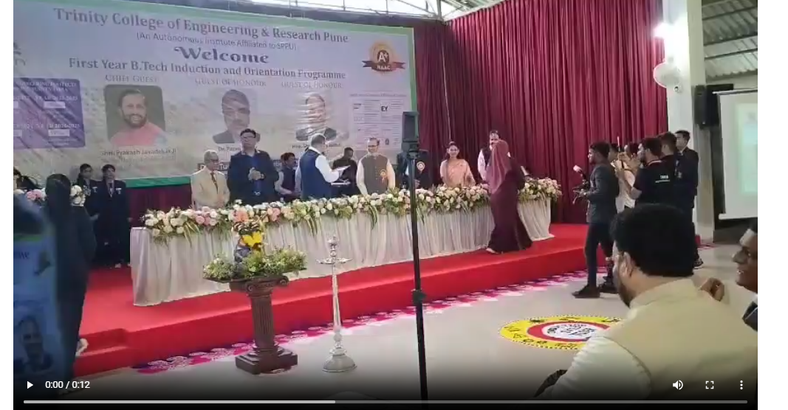
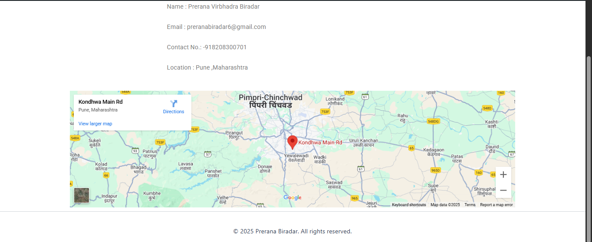

# 🌐 Personal Blog Website

A simple and modern **Personal Blog Website** built with WordPress.  
It includes sections for showcasing information, blog posts, and projects.  

---

## 📌 Pages

- **Home** – Landing page with an introduction.  
- **About** – Short bio and background information.  
- **Blog 1** – First blog post with insights/ideas.  
- **Blog 2** – Second blog post sharing experiences.  
- **Projects** – Showcase of personal and academic projects.  
- **Contact** – A page to get in touch via form or email.  

---

## 🖼️ Screenshots

### Home Page  

### About Page  

### Blog 1  

### Blog 2  

### Projects  

### Contact  

---

## ⚡ Features

- Clean and responsive design  
- Organized sections (Home, About, Blog, Projects, Contact)  
- Easy navigation and customization  

---

##👩‍💻 Author

Prerana Biradar
