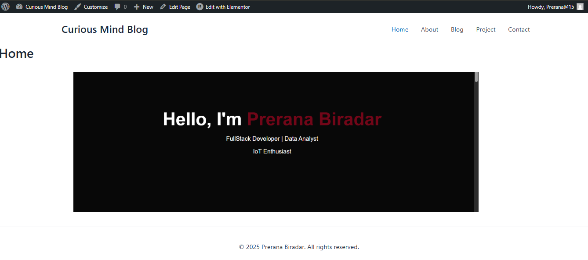
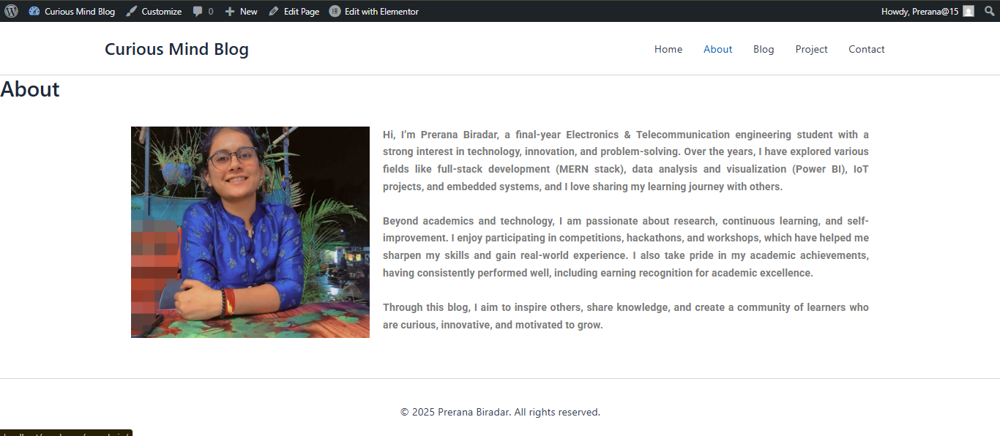
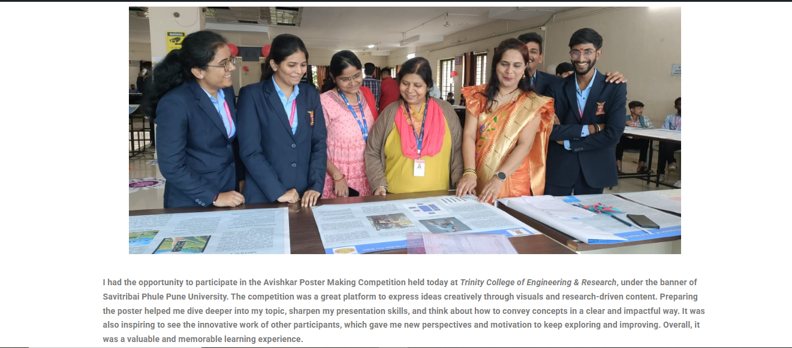
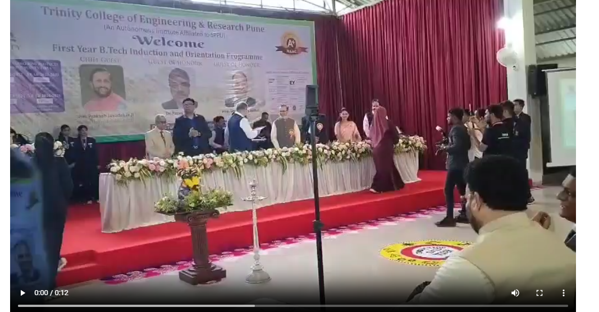
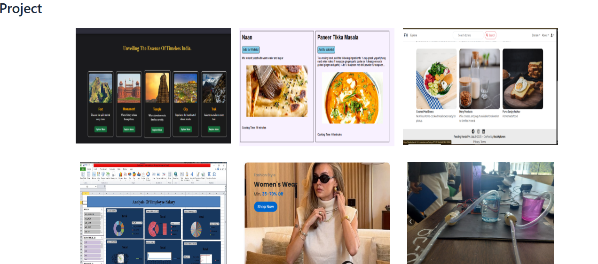
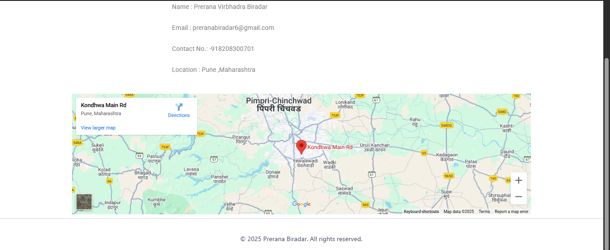

# 🌐 Personal Blog Website

A modern and responsive **Personal Blog Website** developed using **WordPress**.  
This project focuses on creating a clean and structured platform to showcase blogs, projects, and personal information.

> ⚠️ **Note:** This project is currently running on a local environment. The GitHub repository is maintained for code versioning and demonstration purposes.

---

## 📌 Overview

The website is designed as a **content-driven platform** where users can explore blog posts, learn about the author, and view showcased projects. It follows a simple and intuitive layout to ensure a seamless user experience.

---

## 🧩 Pages & Structure

- **Home** – Introduction and landing section  
- **About** – Personal background and information  
- **Blog 1** – Detailed experience and key learnings from the *Avishkar Innovation Competition*  
- **Blog 2** – Achievement story on securing *First Position in the ENTC Department*, along with recognition and award   
- **Projects** – Showcase of personal and academic work  
- **Contact** – Communication page with contact form/email  

---

## ⚡ Features

- ✅ Built using **WordPress CMS**
- ✅ Clean and responsive UI design  
- ✅ Structured content layout  
- ✅ Easy navigation across pages  
- ✅ Customizable and scalable architecture  

---

## 🖼️ Screenshots

(https://drive.google.com/file/d/1AfGBrvuStRINxo9W7ZrABZk2Y1Tl865p/view) 

---

## 🛠️ Tech Stack

- **CMS:** WordPress  
- **Frontend:** HTML, CSS  
- **Hosting:** Local Environment (XAMPP / Local Server)  
- **Version Control:** Git & GitHub  

---

## 🚀 Project Purpose

This project was developed to:

- Practice **WordPress development and customization**
- Build a structured **blogging platform**
- Showcase personal work and projects
- Understand content management workflows

---

## 📂 Repository Note

Although the project is currently hosted locally, this repository serves as:

- 📌 Source code management  
- 📌 Version control  
- 📌 Project demonstration for portfolio and resume  

---

## 👩‍💻 Author

**Prerana Biradar**  
Aspiring Full Stack Developer  

---

<b>A clean and structured WordPress blog built for learning, showcasing, and content creation.</b>

